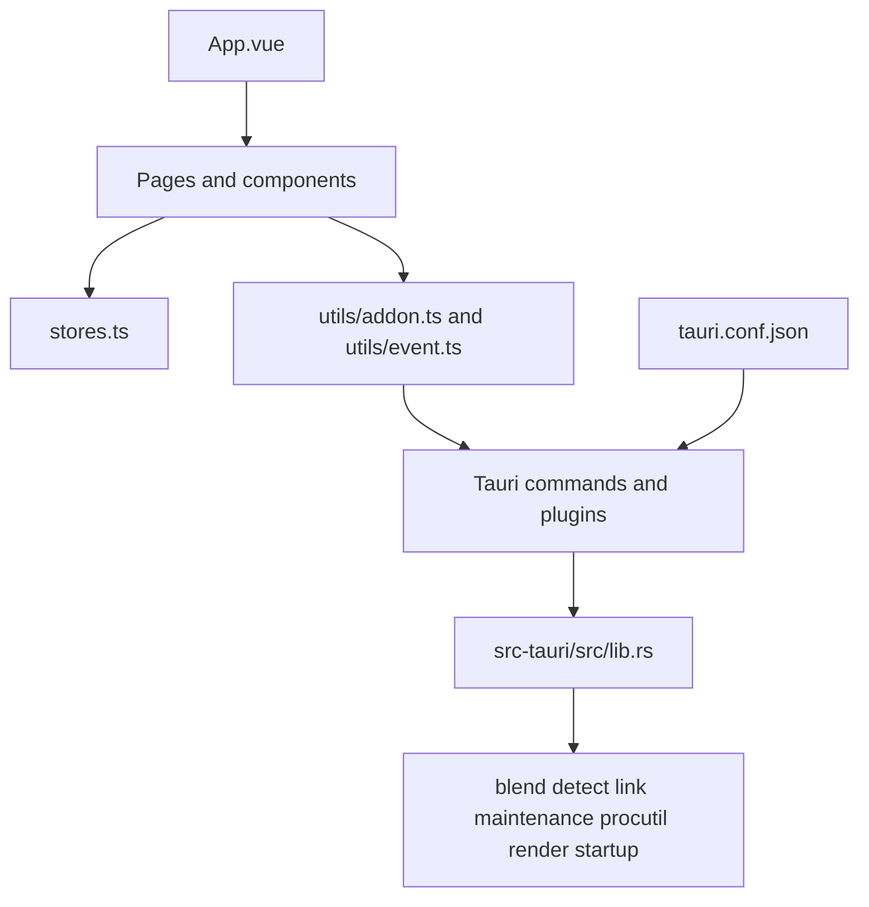

# Project Context

## Purpose

Blender Link is a Windows-first Tauri desktop utility for detecting Blender installations, linking Blender add-ons into a selected Blender user directory, inspecting `.blend` files, and rendering or starting Blender workflows.

Current release target: `1.0.1`.

## Architecture

- Vue 3 + Vuetify frontend in `src/`, built by Vite.
- Tauri 2 shell in `src-tauri/`; Rust commands are registered in `src-tauri/src/lib.rs` and implemented across `blend.rs`, `detect.rs`, `link.rs`, `maintenance.rs`, `procutil.rs`, `render.rs`, and `startup.rs`.
- `src/stores.ts` owns persisted UI state; `src/utils/` contains frontend integration helpers.
- `src-tauri/tauri.conf.json` controls the desktop window, bundling, and Vite dev URL.

## Entry Points And Workflows

- Frontend: `src/main.ts`, `src/App.vue`, and page components under `src/pages/`.
- Rust runtime: `src-tauri/src/main.rs` delegates to the library crate; `src-tauri/src/lib.rs` builds the Tauri application.
- Development/build: `npm run dev`, `npm run desktop:dev`, `npm run build`, and `npm run desktop:build` (the `tauri`/`tb` aliases are retained).
- Verification: `npm run typecheck`, `npm run build`, `npm run rust:test`, `cargo check --manifest-path src-tauri/Cargo.toml`, and `cargo clippy --manifest-path src-tauri/Cargo.toml --all-targets -- -D warnings`.

## Constraints And Risks

- Keep frontend and Rust versions aligned when releasing.
- Windows registry, filesystem permissions, process management, and NTFS junction behavior are platform-sensitive.
- Render cancellation is keyed by job IDs; startup-window requests are retained, and retries receive fresh IDs.
- Packaging must use the configured Tauri bundle targets and exclude agent-only files from release artifacts.
- Configuration migration, packed-file inspection/unpacking, and parallel rendering command handlers are registered but do not yet have complete frontend workflows; do not advertise them as finished features.

## Current Backlog

- Add a frontend concurrency pool, per-job logs, and controls for the registered parallel render commands.
- Add Settings UI and TypeScript types for `migrate_config`.
- Add file-analysis UI and TypeScript types for `check_blend_files` and `unpack_blend`.
- Add isolated-process startup retesting for slow add-ons.
- Merge newly introduced default Blender versions into persisted user configuration without removing custom versions.

## Module Graph

